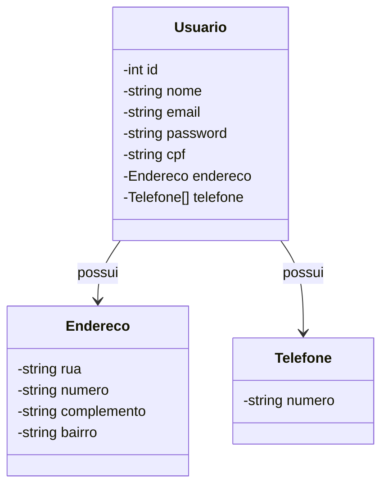

# My First Web API

- Este repositório contém a implementação do meu estudo de uma API REST.
- A intenção principal dele é praticar e relembrar conceitos.

## Tecnologias Utilizadas

- **Java 1.8**: Linguagem de programação principal.
- **Spring Boot 2.7.3**: Framework para criar aplicações Java baseadas em Spring.
- **Maven**: Ferramenta de gerenciamento de projetos e dependências.
- **H2 Database**: Banco de dados em memória utilizado para testes.
- **Springfox (Swagger)**: Para documentação da API.
- **Spring Boot DevTools**: Para facilitar o desenvolvimento com recursos como reinicialização automática.

## Estrutura do Projeto

- `src/main/java`: Contém o código-fonte da aplicação.
- `src/main/resources`: Contém arquivos de configuração e recursos.
- `src/test/java`: Contém os testes unitários.

## Como Executar o Projeto

1. Clone este repositório:
   ```bash
   git clone https://github.com/fefeutitan/myfirstwebapi.git
   
2. Navegue até o diretório do projeto:
   ```bash
   cd myfirstwebapi

3. Compile o projeto:
   ```bash
   mvn clean install

4. Execute a aplicação:
   ```bash
   mvn spring-boot:run

## Testando a API
Utilize uma ferramenta como [Postman](https://www.postman.com/) ou [cURL](https://curl.se/) para fazer requisições à API.

## Exemplos de Requisições
- GET /api/endpoint: Obtém todos os itens.
- POST /api/endpoint: Cria um novo item.

# fefeutitan

## Conecte-se comigo

[](https://www.linkedin.com/in/fernando-ellery-133a209/)

## Skills:


## Contribuições
Contribuições são bem-vindas! Sinta-se à vontade para abrir um issue ou enviar um pull request.

## Licença
Este projeto está licenciado sob a Licença MIT.

## Diagrama de Classes

